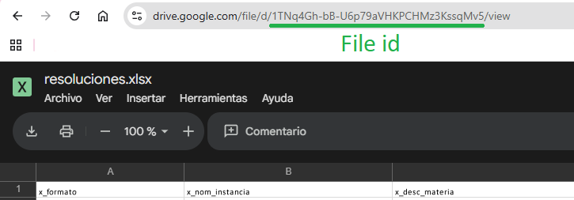

**Example of use pydrive2**

Install


```python
!pip install pydrive2
```


```python
from pydrive2.auth import GoogleAuth
from pydrive2.drive import GoogleDrive
```

Register


You need the file client_secrets.json 

You can get it at Gloogle Cloud -> Credentials -> Create credentials -> OAuth client ID -> Desktop app/Web app


```python
gauth = GoogleAuth()
gauth.LocalWebserverAuth()

drive = GoogleDrive(gauth)
```

Create a pointer to a file to:
- Download: *.GetContentFile("local.pdf")*
- Get Text: *.GetContentString()*
- Modify: *.SetContentString("example text")* / *.SetContentString("example_file.txt")*
- Upload: *.Upload()*
- Refresh: *.FetchMetadata()*
- Delete: *.Delete()*

- Get Metadata: ['title'] (mimeType, fileSize, createDate, alternateLink, etc)

Is recomended first *.FetchMetadata()* to get metadata




```python
# Pointer to a file on Google Drive by its ID
file = drive.CreateFile({'id': '1TNq4Gh-bB-U6p79aVHKPCHMz3KssqMv5'})
```

### Real example:

Save a metadata excel as a list of metadatas


```python
!pip install pandas openpyxl
```


```python
# Download the file content to a local file
file.GetContentFile('tempfile.xlsx')

# Read the Excel file using pandas
import pandas as pd
df = pd.read_excel('tempfile.xlsx', engine='openpyxl')

# Convert the DataFrame to a list of dictionaries
metadatas = df.to_dict(orient='records')

# Remove the temporary file
import os
os.remove('tempfile.xlsx')
```


```python
metadatas[0].keys()
```


    dict_keys(['x_formato', 'x_nom_instancia', 'x_desc_materia', 'x_desc_especialidad', 'x_desc_acto_procesal', 'x_resolucion', 'x_nom_juez', 's_file_pdf', '*'])


